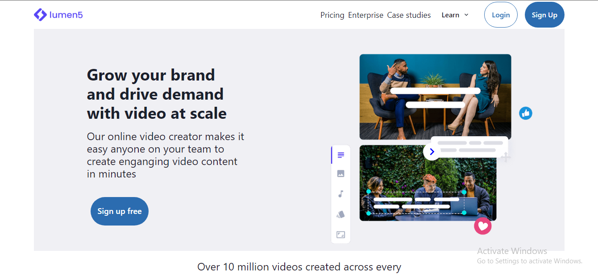

•Lumen5

•It is an online video editing website on which we can create videos for social media. 

•This was a solo project which was done in 4-5 days 

•Features: Homepage, Login/Signup, Dashboard

•Tech-Stack: React, JavaScript, ChakraUi, CSS 

•Arias of responsibility: all of the project 

Live link : https://lumen5clone.vercel.app/

<h2>Some Screenshots of the website :-</h2>

<h2>Homepage :- </h2>

